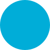

### Hi there 👋

As you can see in some of my repos, beside my regular work I'm a Kata enthusiast.
By doing Katas I try to improve my coding skills, learn new languages and programming paradigms.
And yes, I'm pushing my solutions in repositories to create my own codebase. Have a look:

| Repository                                                         | Language                                                                                                       |                                                                                                |
|--------------------------------------------------------------------|----------------------------------------------------------------------------------------------------------------|------------------------------------------------------------------------------------------------|
| [haskell-katas](https://github.com/borisskert/haskell-katas)       |  [Haskell](https://www.haskell.org/)                 |  |
| [java-katas](https://github.com/borisskert/java-katas)             |  [Java](https://openjdk.java.net/)                         |     |
| [javascript-katas](https://github.com/borisskert/javascript-katas) |  [JavaScript](https://www.javascript.com/)     |                                                                                   |
| [typescript-katas](https://github.com/borisskert/typescript-katas) |  [TypeScript](https://www.typescriptlang.org/) |                                                                                   |
| [csharp-katas](https://github.com/borisskert/csharp-katas)         |  [C#](https://docs.microsoft.com/en-us/dotnet/csharp/) |                                                                                   |
| [cpp-katas](https://github.com/borisskert/cpp-katas)               |  [C++](https://www.cplusplus.com/)                           |                                                                                   |
| [c-katas](https://github.com/borisskert/c-katas)                   |  [C](https://www.learn-c.org/)                                   |                                                                                   |
| [go-katas](https://github.com/borisskert/go-katas)                 |  [GoLang](https://go.dev/)                                     |                                                                                   |
| [swift-katas](https://github.com/borisskert/swift-katas)           |  [Swift](https://www.swift.org/)                         |                                                                                   |
| [python-katas](https://github.com/borisskert/python-katas)         |  [Python](https://www.python.org/)                     |                                                                                   |
| [kotlin-katas](https://github.com/borisskert/kotlin-katas)         |  [Kotlin](https://kotlinlang.org/)                     |                                                                                   |
| [rust-katas](https://github.com/borisskert/rust-katas)             |  [Rust](https://www.rust-lang.org/)                        |                                                                                   |
| [clojure-katas](https://github.com/borisskert/clojure-katas)       |  [Clojure](https://www.clojure.org/)                 |                                                                                   |

### Some stats:

|  |  |
|----------------------------------------------------------------------------------------------------------------------------------------------------------------------------------------------------------------------|--------------------------------------------------------------------------------------------------------------------------------------------------|
